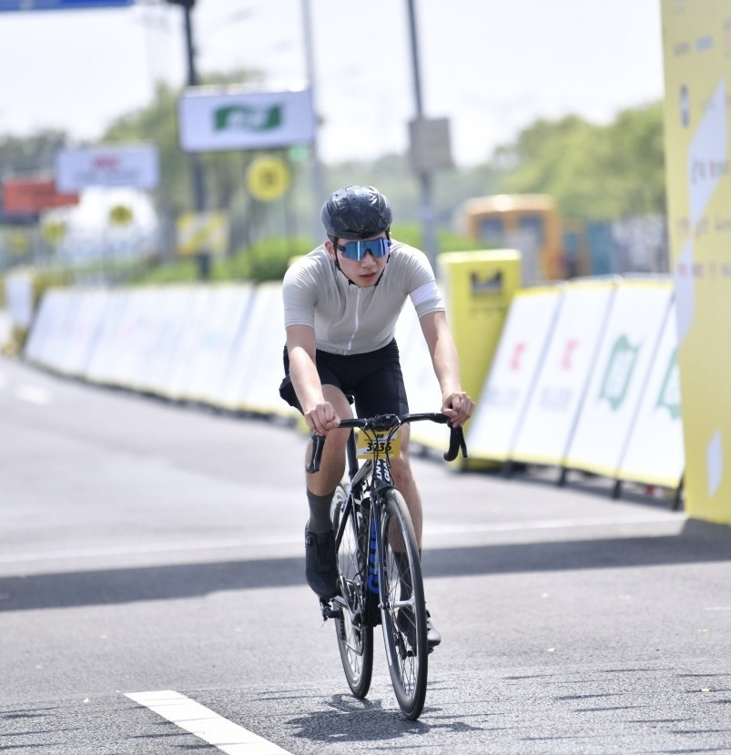
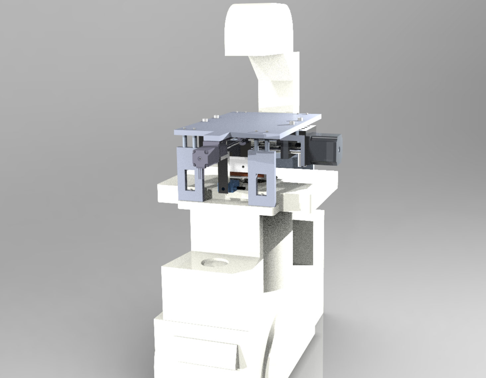
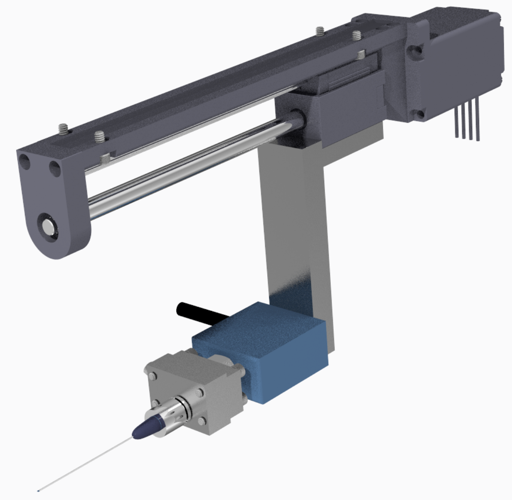

<head>
    
</head>

<head>
    
</head>

<body>
    

        
        <!--  -->
        

            <!-- <h1>Benjamin C Yang</h1> -->
            
 
            I am currently a Masters student in the Mechanical Engineering Department of the University of Illinois at Urbana Champaign. I am a graduate research assistant in the Reliable Autonomy Group @ UIUC. I aspire to become a full stack robotics engineer, working with both software and hardware.   
            
            In my free time I love to build and ride bikes, and apply endless upgrades to my ender3 printer.

            Thingiverse Designs: https://www.thingiverse.com/byang11259/designs
            

        

    

</body>
---

 Past Projects

<!-- Ongoing work -->

    

  
ME461 Project: Segbot

  
Fall 2024

Work in progress...

    

  
Vision based drone Racing

  
Fall 2024

Work in progress...

<!-- NeRF Simulation -->
<body>
    

        
        
    

</body>

  
UAV Simulation: Vision-based Closed Loop Navigation

  
Fall 2023

Closed loop vision-based simulation for quadcopter. Images generated from NeRF model of the flying arena. Quadcopter running monte carlo particle filter localization. 

TACAS Submission 2024   
[GitHub Link](https://github.com/byang12159/NeRF_UAV_simulation)

<!-- RAL PAPER -->

    

  
UAV Landing Using Perception Contracts

  
Spring 2023

Demonstrate learning-based approach that can automatically characterize the error of a perception module from data and use this for
safe control. The proposed approach constructs a perception contract (PC), which generates a set that contains the groundtruth
value that is being estimated by the perception module, with high probability.

The PC technique is applied for the vision pipeline in the UAV safe-landing scenario. A PC is trained from ground truth data. A controller is designed to utilize the PC. Experiments show that with the control algorihtm with learned PC can safely land the quadcopter despite error from the perception module, while the baseline algorithm without PC failed to do so.

Accepted ICRA 2024

    

  
ME446 Project: 6DOF Manipulator Scripting

  
Spring 2023

Complete the test environment while demonstrating task space PD and feed forward control tracking, force control, and impedance control.

    <!-- Image 1 -->
    

        
    

    <!-- Image 2 -->
    

        
    

  
Automated Needle Insertion Mechanism for Needle Tribology

  
Fall 2022

Needles are subject to a variety of forces as they are inserted into a body. Through a better understanding of the forces present as needles are traveling through soft material, people can optimize the longevity of needles and reduce its damage on patients. 

The purpose of this project is to construct a setup that provides a controlled and repeatable study of the needle insertion process. A mechanism mounts on top of an inverted microscope to image the contact in situ and collects compression and tension forces. As a senior design project, the project has been commissioned and directed by Dr. Alison Dunn for future research within her lab.

<body>
    

        
        
    

</body>

  
ECE484 Project: Carla Simulator

  
Fall 2022

The simulation is part of the Generalized Racing Intelligence Competition (GRAIC). Given
ground-truth perception information, the focus of the project is on the planning and control of the vehicle. An aggressive and fast
controller is developed to complete the generalized race course in the shortest amount of time and evade the most number of obstacles.

The controller utilizes PRM-variant as its sampling strategy and finds shortest path by performing topological sort in a directed acyclic graph.

Lateral control of the car is based on a PD controller.
For longditudinal control, the acceleration is based on path curvature. Using the current position of the car and the next two waypoints on our
path, we calculated the radius of the circle generated from those three points. The radius of the circle tells us how much curvature is coming up in our path. We tuned a logarithm relationship between the radius and desired vehicle speed

    

  
Design and Clinical Validation of a Robotic Ankle-Foot Simulator for Ankle Clonus

  
Spring 2020

Undergraduate Researcher at Human Dynamics and Controls Laboratory (HDCL), advised by Dr. Pei Yinan and Professor Elizabeth Hsiao-Wecksler

The standard clinical assessment of neurological diseases lies with a clinicians' manual techniques to elicit muscle response.  Their effectiveness and accuracy largely lies in their past experience and training. Traditional clinical training of motor skill assessment is limited because it relies on the instructor bringing in live patients for students to practice upon. The project aims to provide a medical training simulator that will be  accessible and provide consistent training opportunities for students that replace or reduce the need for human patients .

Design a support system for the leg joint that will provide:
<ul>
    <li>Ability to imitate situations when patient is lying down and their legs flat out, and when patient is sitting down</li>
    <li>Ease of Transportation: The total weight of the frame is approximately 1.4 kg. The base HDPE plate is removable with 4 winged nuts for a more compact carry</li>
    <li>Ability for practitioner’s secondary hand to apply leverage to the underside of the thigh segment</li>
</ul>

    

  
Passive Hydraulic Simulator for Biceps Spasticity

  
Fall 2019

Undergraduate Researcher at Human Dynamics and Controls Laboratory (HDCL), advised by Dr. Pei Yinan and Professor Elizabeth Hsiao-Wecksler

Spasticity is often found in patients with stroke, spinal cord injuries, and other neurological disorders causing abnormal motor activity. Spasticity can cause involuntary muscle contractions, spasms, and continuous muscle stiffness that affect body growth.

The current assessment for spasticity relies on the past experiences of the clinician, which is difficult in training due to the difficulty in bringing in live patients. The motivation of this project is to provide a self-contained and unpowered simulator that will provide additional hands-on practice in the current training program.

The simulator will replicate the response of spasticity patients through an adjustable hydraulic piston. When certain technique checkpoints are accomplished, the electronic feedback will inform the user on their results.

