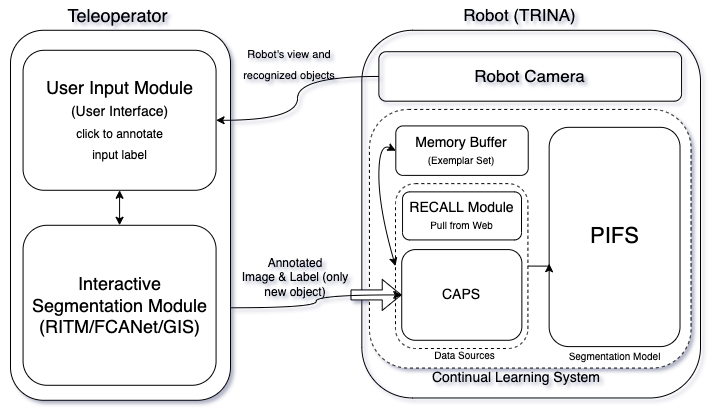

<head>
    
</head>

<head>
    
</head>

<body>
    

        
        

            
 
                Hello! My name is Marcanthony Huang. I am a recent graduate from the University of Illinois Urbana-Champaign. My professional journey and academic experiences have fueled my passion for computer hardware design and system programming. I have had the privilege of collaborating with Google DeepMind researchers on cutting-edge machine learning assisted computer architecture projects and have engineered large-scale microarchitecture design space exploration frameworks. My work spans from modifying HDL compilers for custom RISC-V vector processors to assisting in the development of a Unix-based operating system kernel in C and x86 assembly. 
            

        

    

</body>
---

 Projects

<body>
    

        
    

</body>

  
Research Project: ML-Driven Hardware Design Space Exploration

  
Fall 2023

As a Software Engineer and Research Assistant at the Future Architecture and System Technology for Scalable Computing Laboratory, I collaborated with Google DeepMind researchers on machine learning-assisted computer architecture projects. I engineered a large-scale microarchitecture design space exploration framework using Python and PyTorch, incorporating open-source RTL synthesis tools, reinforcement learning frameworks, and architecture simulators. Additionally, I modified open-source HDL compilers in C++ to create custom SystemVerilog intermediate representations, enabling the integration of custom RISC-V vector processor architectures into machine learning frameworks.

 

    

  
ORCA-OS: A functional Unix-based OS kernel

  
Spring 2023

I embarked on a semester-long project to design and implement the ORCA Operating System, a functional Unix-based operating system kernel written in C and x86 assembly. This project involved creating a kernel capable of paged virtual memory management, interrupt handling, and process scheduling. Key features of ORCA OS include an in-memory file system, user/kernel privileges, multiple terminals, a virtualized clock, preemptive scheduling, USB/PS2 keyboard input, and full-color VGA Mode-X output. 

[GitHub Link](https://github.com/marchuang6272/ORCA-OS/tree/main)

        
        
        

  
Intelligent Motion Laboratory: Image Segmentation Labeler

  
Spring 2022

As an undergraduate research assistant at the Intelligent Motion Laboratory, I contributed to the development of computer vision modules for a teleoperated robot, which achieved 4th place in the XPRIZE Global Avatar Competition. I also engineered a browser-based data labeling tool using React and Flask to facilitate computer vision research, focusing on few-shot, incremental, and continuous learning for robotic systems. Additionally, I deployed various PyTorch models using Flask to expose a REST API for model inference and implemented publisher/subscriber communication using ROS and C++ to connect single-board computers with a linear hydraulic actuator system.

[Video Link](https://www.youtube.com/watch?v=dt3At7YwxKM)

[Github Link](https://github.com/RogerQi/XMem)

