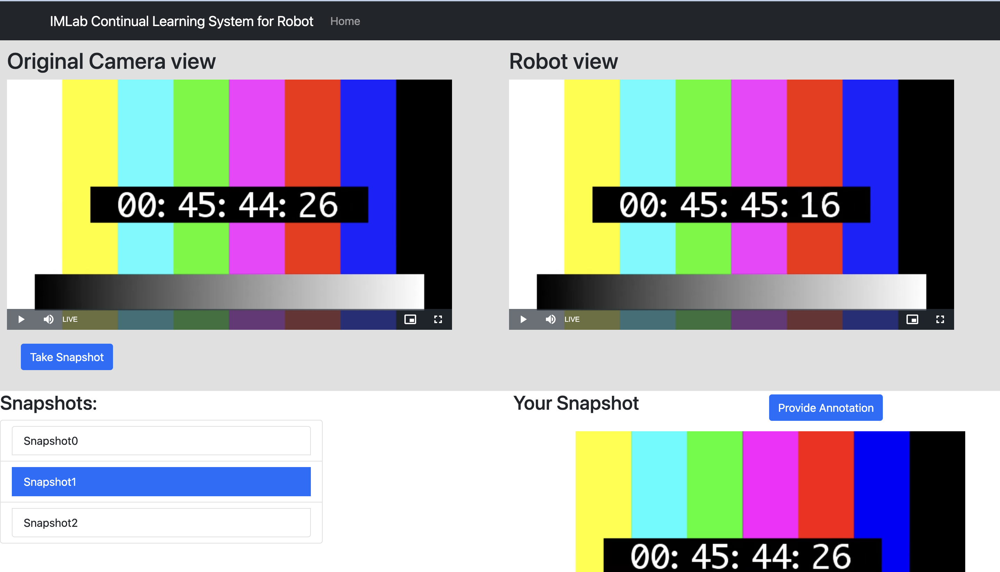

<head>
    
</head>

<head>
    
</head>

<body>
    

        
        

            
 
                Hello! My name is Marcanthony Huang. I am a recent graduate from University of Illinois Urbana-Champaign’s Grainger College of Engineering. Within software engineering, my skills and interests revolve around computer hardware, systems programming, and machine learning. Outside of industry, I am passionate about computer engineering research, specifically in computer architecture and robotics. Currently, I work as a software engineer and researcher at the Future Architecture and System Technology for Scalable Computing Laboratory. 
            

        

    

</body>
---

 Projects

<body>
    

        
    

</body>

 

  
Current Work: Machine Learning for Computer Architecture

  
Fall 2023

 
    As a software engineer and research assistant at the Future Architecture and System Technology for Scalable Computing Laboratory, I collaborate with Google DeepMind researchers on machine learning-assisted computer architecture projects. We developed an open-source framework for generating processor microarchitectures at the RTL level, featuring a graph-based model with nodes for hardware modules and edges for interfaces. This model enables rapid evaluation of design points using graph neural networks (GNNs) or HDL generation for synthesis and simulation, exploring both hardware parameters and graph structures. I contributed by developing a design space exploration framework using Python and PyTorch and modifying HDL compilers in C++ to integrate custom RISC-V vector processor architectures, enhancing computer architectures for efficient performance estimations and HDL generation.

 

    

 

  
ORCA-OS: A Functional Unix-based OS Kernel

  
Spring 2023

 
    I worked on a semester-long project to design and implement a functional Unix-based operating system kernel written in C and x86 assembly. Features of the kernel include paged virtual memory management, interrupt handling, and process scheduling. In addition, ORCA-OS includes an in-memory file system, user/kernel privileges, multiple terminals, a virtualized clock, preemptive scheduling, USB/PS2 keyboard input, and full-color VGA Mode-X output. 

[GitHub Link](https://github.com/marchuang6272/ORCA-OS/tree/main)

 

        
        
        

 

  
Intelligent Motion Laboratory: Image Segmentation Labeler

  
Spring 2022

 
    I initially came to university with an interest in robotics, and it was working in a robotics lab that sparked my interests in system software and computer architecture. As an undergraduate research assistant at the Intelligent Motion Laboratory, I contributed to enhancing the computer vision system by creating a real-time image segmentation labeler that connected to the robot's camera feed and backend computer vision models. This tool allowed a robot operator to improve image segmentation models in real time during a robot's operation. 

[Video Link](https://www.youtube.com/watch?v=dt3At7YwxKM)

[Github Link](https://github.com/RogerQi/XMem)

 

    

 

  
Class Project: Homomorphic Encryption Hardware Accelerator

 
    My group developed a hardware accelerator in SystemVerilog to enhance the performance of the BFV homomorphic encryption scheme, focusing on accelerating the computation bottleneck: polynomial multiplication. By parallelizing this process, our accelerator significantly speeds up computations. Key primitives for encryption and decryption are stored in hardware registers to support efficient operations. Homomorphic encryption is significant because it allows secure computations on encrypted data without the need to decrypt it, protecting data privacy in untrusted environments.

[Github Link](https://github.com/marchuang6272/HE_project/tree/main)

 

    

 

  
ACM SIGARCH Presentation: High Performance Computing

[Video Link](https://youtu.be/4Nr2-94_ksU)

